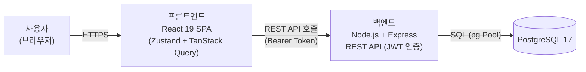
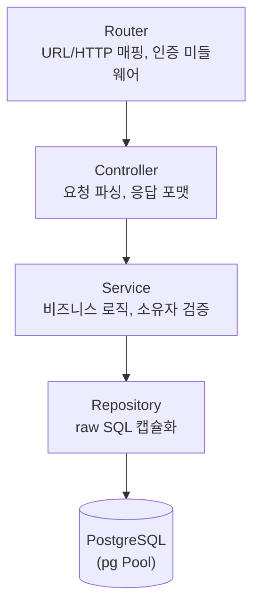
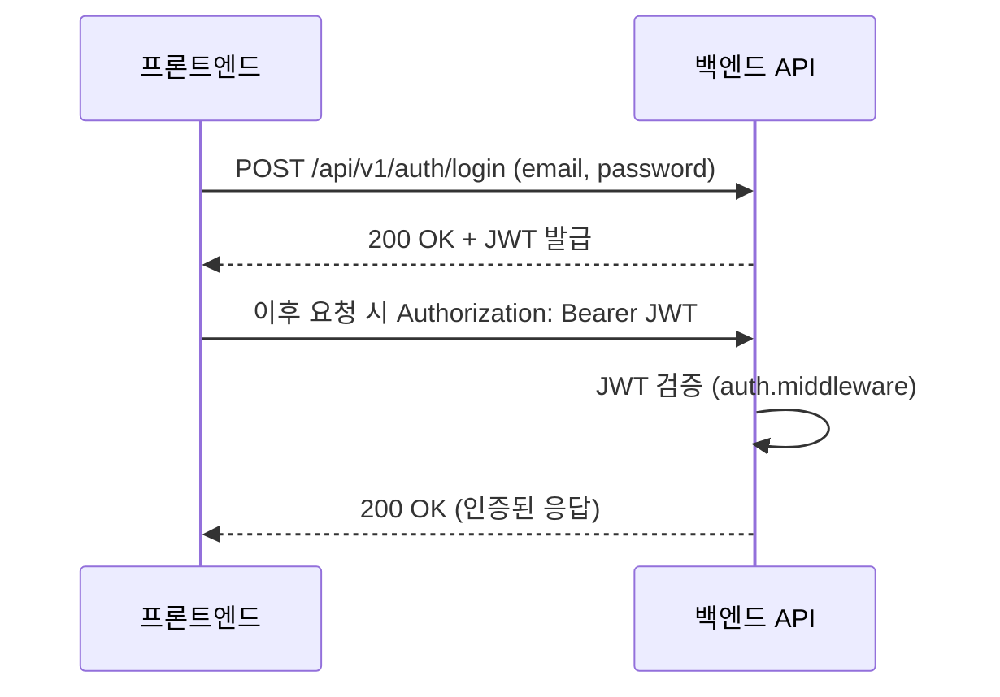

# TodoList 기술 아키텍처 다이어그램

버전: 1.0 / 작성일: 2026-07-29

참조: `1-domain-definition.md`, `2-PRD.md`, `4-project-structure.md`

MVP(1인 개발, 2일 일정, 단일 인스턴스 배포) 수준에서 전체 그림을 한눈에 파악할 수 있도록 최대한 단순화한 다이어그램이다.

## 1. 전체 시스템 구성도

브라우저(SPA) ↔ 백엔드(REST API) ↔ DB로 이어지는 최상위 구조. 프론트/백엔드는 분리 배포되며, 인증은 JWT 기반 stateless 방식이다.

## 2. 백엔드 계층 구조도

`Router → Controller → Service → Repository → DB` 단방향 의존 구조. Router는 라우팅/인증 미들웨어만, Controller는 요청/응답 처리만, Service는 비즈니스 로직만, Repository는 SQL만 담당한다.

## 3. 인증 흐름

로그인 시 JWT 발급 후, 이후 요청마다 Authorization 헤더에 토큰을 첨부해 서버가 검증하는 stateless 인증 흐름이다.

