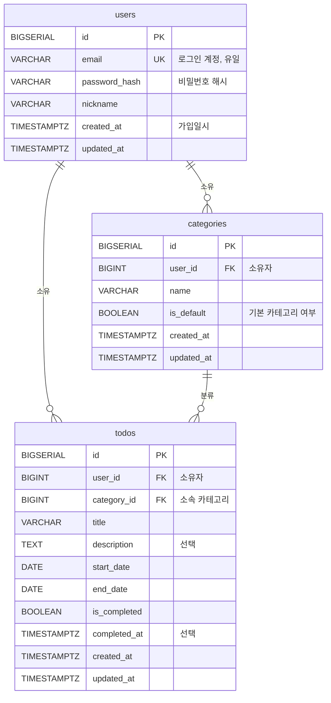

# TodoList ERD (Entity-Relationship Diagram)

버전: 1.0 / 작성일: 2026-07-29

참조: `1-domain-definition.md`, `4-project-structure.md`

`users`, `categories`, `todos` 3개 테이블로 구성된다. 컬럼명은 snake_case, PK는 `id`(BIGSERIAL)로 통일한다.

## ERD

## 타입 선택 근거

- ORM 없이 raw SQL(pg)을 사용하므로 UUID 대신 `BIGSERIAL`을 PK로 채택해 자동 증가 정수 ID로 단순하게 관리한다.
- 일시 컬럼은 타임존 이슈를 배제하기 위해 `TIMESTAMPTZ`, 순수 날짜(시작/종료일자)는 `DATE`를 사용한다.

## 핵심 제약조건 및 정책

- `users.email`은 `UNIQUE` 제약(UK)으로 로그인 계정의 유일성을 보장한다.
- `categories.user_id`, `todos.user_id`, `todos.category_id`는 모두 `NOT NULL` FK이며, Repository 조회 시 항상 `user_id` 조건을 함께 사용해 소유자 기반 접근을 강제한다.
- `todos`에는 `CHECK (end_date >= start_date)` 제약을 두어 종료일자가 시작일자보다 이전인 데이터를 DB 레벨에서도 차단한다.
- `categories.is_default`로 사용자별 '기본' 카테고리를 식별한다(마이그레이션 `004_seed_default_category.sql`에서 사용자 가입 시 함께 시딩). 카테고리 삭제 시 `category_id`는 NULL이 되지 않고, 애플리케이션(Service) 트랜잭션에서 소속 `todos.category_id`를 해당 사용자의 '기본' 카테고리 ID로 일괄 재할당한 뒤 카테고리를 삭제한다(단순 FK `ON DELETE` 액션만으로는 "동일 소유자의 기본 카테고리로 이관"을 표현할 수 없어 애플리케이션 레벨 처리를 택함).
- `status`(시작전/진행중/완료/기한초과)는 저장 컬럼이 아니다. `todos.is_completed`, `todos.start_date`, `todos.end_date`(완료 시 `completed_at`)를 기준으로 조회 시점에 계산되는 파생값이므로 테이블에 포함하지 않는다.
